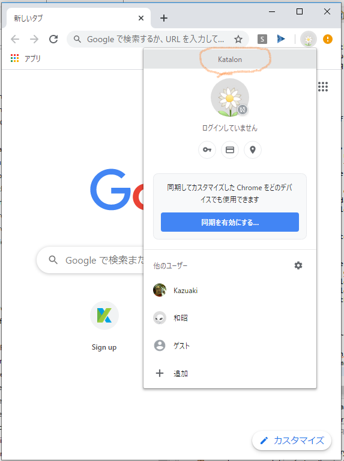
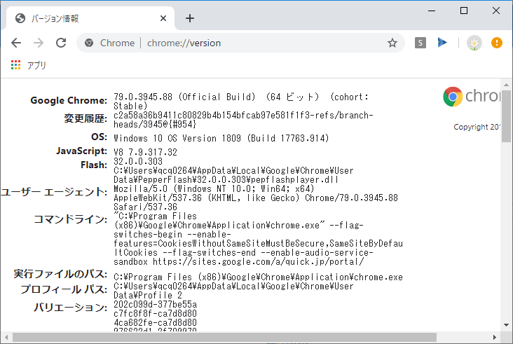

Opening Chrome with client-side storage taken over from previous session
========================================================================

- by kazurayam,
- 1st edition published March,2019
- 2nd edition published Jan, 2020

## Summary

Some web apps employ client-side storage in web browsers: Cookie, LocalStorage and SessionStorage. Usually we test them with clean Browser. I mean, we will lauch Browser with empty Cookies and LocalStorage emtpy in order to make tests run stable. However, in some situation, we want to launch Browser with client-side storage filled and prepared to meet testing criteria (login with username/password already done, personal preferences recognized). Setting up Cookies and LocalStorage can be a lengthy, cumbersome task. Therefore we want to reuse the prepared content of Cookies and LocalStorage.

I have developed a set of custom Groovy classes.

1. `com.kazurayam.thoughtful.ChromeDriverFactory` class
2. `com.kazurayam.thoughtful.ChromeProfileBackupAndResutlre` class

Using them, you can prepare (prior to running a test) a Chrome Profile filled with Cookie and LocalStorage and back it up. You can restore a Profile with the backup and run tests while launching Chrome browser specifying the Profile you prepared.

## API doc

The Groovydoc of webdriverfactory4ks is [here](https://kazurayam.github.io/webdriverfactory4ks/api/index.html)

## Problem to solve

A post in the Katalon Forum [Run Automation in the Active browser](https://forum.katalon.com/t/run-automation-in-the-active-browser/19237/4) raised an interesting question. The originator **aguggella** gave us a good explanation what his/here problem is. I would quote the paragraphs with a bit of rewording:

---

>I have Salesforce application which will send OTP (one time password) to the client's browser on the following occasions: (1) first time of logging-in, (2) at the second logging-in and later when the browser does not present credential information associated with the original OTP because the browser's cache is cleared or empty

>I need to open browser manually and login to the Salesforce application once. A new OTP will be issued and processed. I will do that anyway. As long as I use the same Profile of Browser without clearing cached data, the original OTP is retained in the cache. I will not be asked to repeat login operation.

>Problem arises here: I want to automate testing the Salesforce application using Katalon Studio, but I can not. Why? Whenever I start test script, Katalon executes opens a new browser with no cached data. Therefore Salesforce application sends a new OTP. New OTP requires my manual intervention. Automation broken.

---

Let me assume, I opened Chrome with a Profile 'Katalon' and logged-in Salesforce applition.
If I could somehow let Katalon Studio to start Chrome with the same Profile 'Katalon',
then the test will run without requiring manual intervention.
But how can I achieve it?


## Problem analysis

### How to open Chrome with predefined profile


**Thanh To**, a Katalon Developer, replied to **aguggella** in another post [Open Browser with Custom Profile](https://forum.katalon.com/t/open-browser-with-custom-profile/19268). He described the following points:
1. In Chrome UI, you can create a new Profile with name `new_chrome_profile`
2. In Chrome UI, you can identify the Profile path, a folder, where all of cached data is stored. For example, the Profile `new_chrome_profile` is found associated with the  `C:\users\osusername\AppData\Local\Google\Chrome\User Data\Profile 2` folder. The association of `new_chrome_profile` and `Profile 2` was determined by Chrome when `new_chrome_profile` was added.
3. In Katalon Studio, in test case script, you can write Groovy code to open Chrome browser as this:
```
ChromeOptions chromeProfile = new ChromeOptions();
chromeProfile.addArguments("user-data-dir=" + "C:\\Users\\thanhto\\AppData\\Local\\Google\\Chrome\\User Data\\");
chromeProfile.addArguments("profile-directory=Profile 2");
```

### Terminologies

Let me make the meaning of 2 important terminologies clear.

1. What does `Profile` means in Chrome?
2. What does `profile-directory` or `Profile path` means in Chrome?

You can add `a User` or `a Profile` into Chrome. See https://support.google.com/chrome/answer/2364824?hl=en&co=GENIE.Platform=Desktop how to.
I have a Profile named `Katalon` in my Chrome as follows:



Once I open Chrome with `Katalon` profile, and navigate to `chrome://version` page, then I can see the following:



Here I could find a line:

```
Profile Path: C:\Users\kazurayam\AppData\Local\Google\Chrome\User Data\Profile 2
```

This is the `Profile Path`. And the name of the folder `Profile 2` is the `profile-directory`.

### Core issue

It's great to know that I can write test code that can open Chrome with predefined Profile. But I find a itchy problem still remains.

- I created a new Profile with name `Katalon`.
- Chrome creates a new folder named `Profile 2`.
- Chrome associates the Profile `Katalon` to the profile-directory `Profile 2`.

It's OK for me to write the profile name `Katalon` as a constant string in test cases.

But I do not like to write the folder name `Profile 2` as a constant string in my test case code.

I know I can view and find the folder name by checking the `chrome://version` page. But this manual preparation looks less stylish. I want automate stuff as much as possible.


## Solution proposed

### (1) ChromeDriverFactory

I have developed a custom groovy class `com.kazurayam.webdriverfactory4ks.ChromeDriverFactory`. Let me show you a sample use case of it. The following script assumes you have Chrome browser installed in your PC, and in it you have pre-defined a Profile with name `Katalaon`. Before executing the script, you want open Chrome with `Katalon` profile and visit whatever URL. Then you want to execute this script. You will find the Chrome browser launched by the test script is using the `Katalon` profile.

[Test Cases/main/example_openChromeDriverWithProfile](Scripts/main/example_openChromeDriverWithProfile/Script1552363369432.groovy)
```
import org.openqa.selenium.WebDriver

import com.kazurayam.webdriverfactory4ks.ChromeDriverFactory
import com.kms.katalon.core.webui.driver.DriverFactory
import com.kms.katalon.core.webui.keyword.WebUiBuiltInKeywords as WebUI

ChromeDriverFactory cdFactory = new ChromeDriverFactory()
WebDriver driver = cdFactory.openChromeDriverWithProfile('Katalon')  // THIS IS THE MAGIC!
assert driver != null
DriverFactory.changeWebDriver(driver)
WebUI.navigateToUrl('https://demoauto.katalon.com/')
WebUI.delay(3)
WebUI.closeBrowser()
```

The following examples will show you how to utilize this.

1. [Test Cases/main/example_openChromeDriverWithProfile](Scripts/main/example_openChromeDriverWithProfile/Script1552363369432.groovy) --- opening Chrome specifying a predefined Profile name
2. [Test Cases/main/example_openChromeDriverWithProfileDirectory](Scripts/main/example_openChromeDriverWithProfileDirectory/Script1552363390928.groovy) --- opening Chrome specifying a name of Profile directory, for example `Default` directory.
3. [Test Cases/main/example_startGmailWithoutLoginOperation](Scripts/main/example_startGmailWithoutLoginOperation/Script1552363984695.groovy) --- this demonstrates that I can navigate into Gmail without login operation if I open Chrome with the `Default` directory.


### (2) ChromeProfileUtils

- take backup of the specified Profile setting to store into a specified location (directory)
- restore a Profile setting from the specified location

in both cases, the Profile is identified by its Profile Name like 'Katalon', not by the profile-directory like 'Profile 2'.

## How to use webdriverfactory4ks.jar in your Katalon project

1. Download the `webdriverfactory4ks-all.jar` from the GitHub project's [Releases](https://github.com/kazurayam/webdriverfactory4ks/releases/tag/0.0) page.
2. Place the jar into the `Drivers` directory of you Katalon Studio project; just as documented in the doc [External libraries](https://docs.katalon.com/katalon-studio/docs/external-libraries.html)
3. Write your test case script which calls the  `com.kazurayam.webdriverfactory4ks.ChromeDriverFactory` class.
